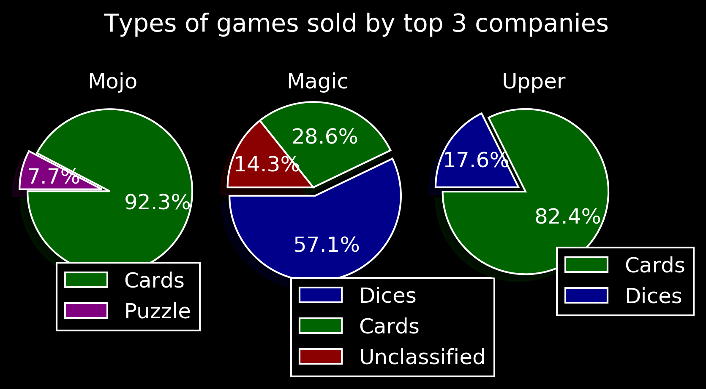

# Board_games_EDA_project
**Description**: An EDA project in which a board game database is analysed to investigate what factors drive sales for these products.

# Code and Resources Used

**Python Version**: 3.7
**Packages**: pandas, numpy, datetime, scipy, sklearn, matplotlib, seaborn, BeautifulSoup, requests, re.

# 1. Data cleaning and feature engineering:

* Handled **Nan values**:
  * Columns with more than **40 %** nan values were directly **removed**.
  * For categorical variables nan values were filled with **"Unknown"**
  * For numerical variables nans were filled with the **median**, after visualy recognizing the presence of **outliers** using boxplots.
  
* Outliers were removed using the **Z-score < 3** approach.

* **Feature-engineering**:
  * A single **"num_players_recommended"** column was created by combining several other columns.
  * Using the "mechanic" column, all boardgames were classified in different group types and a new column **"type of game"** was created.
  * The "owned" and "yearpublished" columns were used to create a column **"owned by year"** which contained the information of how many new users owned each game per year.
  * Using the "averageweight" column (float) a **"weight_level"** column was created by simply changins his data type to int to round the values.
  * Finally, columns **"expansion"** and **"language_dependence"** were converted into boolean (0, 1) columns.
  
 # 2. Exploratory Data Analyses:
 I aimed to aswer the following questions:
 * What games people buy/own the most?
 
   
  
  * What type of games most succesfull companies sell?
  
   
  
  *  What game difficulty people prefer to buy/own?
  
   
  
  * What games have been sold most times?
  
    
   
   # 3. Training a Machine Learning Algorithm:
   
  Furthermore, I attempted to predict the number of owners for a boardgame based solely on some of the game properties. For this I follow the usual steps:
  * Data split and data preprocessing (StandardScaler)
  * Exploring model performance of ML different regression algorithms 
  * Fine tuned the most promissing algo (XGB-Regressor)
  This however rended a poor prediction score, probably because there are other variables that may play an important role in buying a game not considered here. The most prominent example would be the product price. Nonetheless, by taking a look to the feature importance features we can obtain some valuable information about the game characteristics that seem to contribute most to the number of users buying the game:
  
   
  
 # 4. Conclusions
 Overall, some of the interesting insights we got from these analyses is that **games with a high number of sales** are most likely: 
 * **Card games** 
 * With a **medium level of difficulty**.
 * **High minimum age**
 * With **no time or player restrains**.
 * **Expansions** (Normal, since they are well-stablished games)
 
  **Future work**:
   * It would be interesting to get the **prices** of each boardgame to analyze whether if card games are sold mostly because they are often cheaper.
   * With the price info we could also create a new feature of **price * owner** to study in what boardgames most money has been spent on.
   * Also, with price invested in the manufacturing of each game we could finally obtain a list of the **most profitable games**.
   * Finally, in the future I will use a **clustering** technique to group games. This can be useful for shop owners to suggest to the user similar games to those that they have alredy liked.
  
